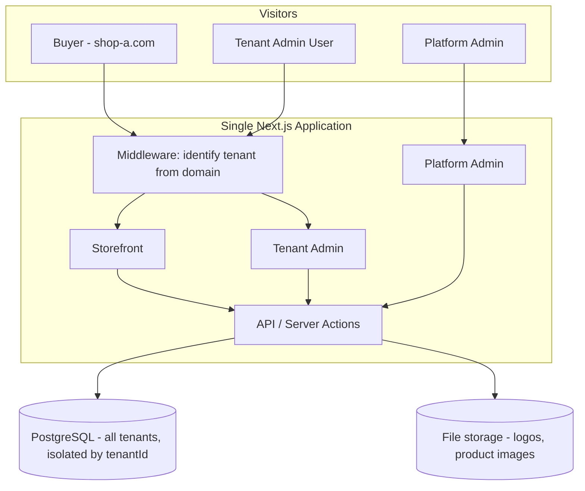

# Architecture Overview

Status: **Approved** (foundation) — individual future sections marked otherwise.

## Product Vision

A reusable, multi-tenant, white-label e-commerce platform for physical products. One
codebase powers many independently-branded online stores ("tenants"), each with its
own domain, branding, products, orders, customers, and payment/shipping configuration.

Initial market: Vietnam.

## V1 Scope (Approved)

In scope:
- Physical products only (no digital goods, no ticketing/events)
- Buyer storefront, Tenant Admin, Platform Admin
- CSV product import
- Payment methods: Cash on Delivery (implemented), MoMo and Bank Transfer (designed
  for, added later without checkout redesign — see [decisions.md](decisions.md) #006)
- Per-tenant configurable shipping
- Per-tenant branding: logo, colors, images, layout variation
- Subdomain-based tenant access (`shop-a.yourplatform.com`) and custom domains
  (`shop-a.com`)

Out of scope for V1 (Proposed, not decided):
- Ticketing/events
- Marketplace features (multi-vendor within one tenant)
- Multi-currency / multi-language (may be needed later, not designed yet)
- Advanced scale (see Trade-offs below) — designing for ~50 tenants, not thousands

## High-Level System

One Next.js application serves three "faces" from the same codebase:

1. **Storefront** — public buyer-facing shop, rendered per-tenant
2. **Tenant Admin** — used by a tenant's own staff to manage their shop
3. **Platform Admin** — used by the platform owner to manage all tenants

All three share one PostgreSQL database. Tenants are separated by data (a `tenantId`
on every tenant-owned row), not by separate deployments or databases. See
[multi-tenancy.md](multi-tenancy.md) for details.

## Technology Stack (Approved for V1)

| Layer | Choice |
|---|---|
| Frontend + backend | Next.js (App Router), TypeScript |
| Database | PostgreSQL (managed, e.g. Neon) |
| ORM | Prisma |
| Auth | Clerk (see [decisions.md](decisions.md) #005) |
| File storage | S3-compatible (e.g. Cloudflare R2) — not yet implemented |
| Hosting | Vercel |

Rationale for this stack is a Product Owner-facing explanation, not repeated here —
see prior project discussion. In short: managed services, minimal operational burden,
proven at small-to-mid scale, nothing here needs to be replaced to grow to ~50 tenants.

## Domain Strategy

See [multi-tenancy.md](multi-tenancy.md#tenant-identification) for the full
explanation of how a request's domain is resolved to a tenant.

- **Development/testing**: platform subdomains, e.g. `shop-a.yourplatform.com`
- **Production**: tenant-owned custom domains, e.g. `shop-a.com`, mapped to a tenant
  via a domain-mapping table
- Both mechanisms are supported by the same resolution code path (Approved direction;
  exact domain-mapping table schema is Proposed, will be finalized during the walking
  skeleton).

## Walking Skeleton (Approved direction, not yet implemented)

The first working slice of the platform, built to prove tenant isolation works
end-to-end before any commerce feature is built:

1. A `Tenant` table/model in the database
2. A minimal Platform Admin screen to create a tenant (name, subdomain, branding)
3. A minimal Tenant Admin screen to edit that tenant's own branding
4. A bare storefront homepage that renders differently per tenant, resolved via
   subdomain or custom domain

No products, cart, checkout, or payments are part of the walking skeleton. Its only
purpose is to validate tenant resolution, isolation, and branding rendering.

## Important Trade-offs (Proposed, current thinking)

- **Shared database over database-per-tenant**: chosen for operational simplicity at
  ~50-tenant scale. Trade-off: requires strict, consistently-enforced query scoping
  (see [security.md](security.md)). Revisit only if a tenant requires physical data
  isolation for compliance reasons, or scale grows far beyond current assumptions.
- **Shared application over per-tenant deployment**: one app to build, test, deploy,
  and monitor. Trade-off: a bug affects all tenants simultaneously; mitigated by
  standard testing/staging practices, not yet formally defined.
- **Managed hosting/DB over self-hosted**: optimizes for low operational burden at
  MVP stage over raw cost-at-scale. Revisit if usage-based pricing becomes expensive
  at higher tenant counts.

## Current Assumptions

- No confirmed production tenant yet; platform is being built as a reusable product
  from the start.
- Target scale: ~50 tenants. Not designing for orders-of-magnitude beyond this.
- Single technical implementer (Claude) with a non-technical Product Owner.
- No hard deadline; prioritizing a sound foundation over speed.
- Vietnam is the initial market — implies VND currency and local payment methods
  (MoMo, bank transfer) as first-class, not afterthoughts, even though only COD ships
  first.
